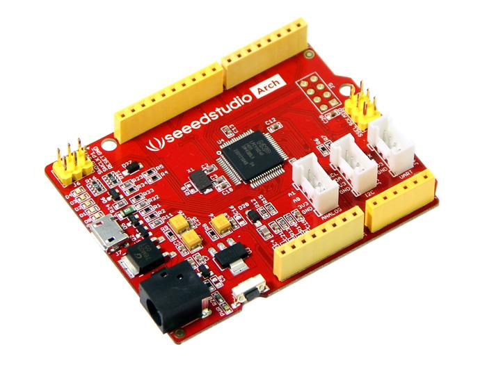
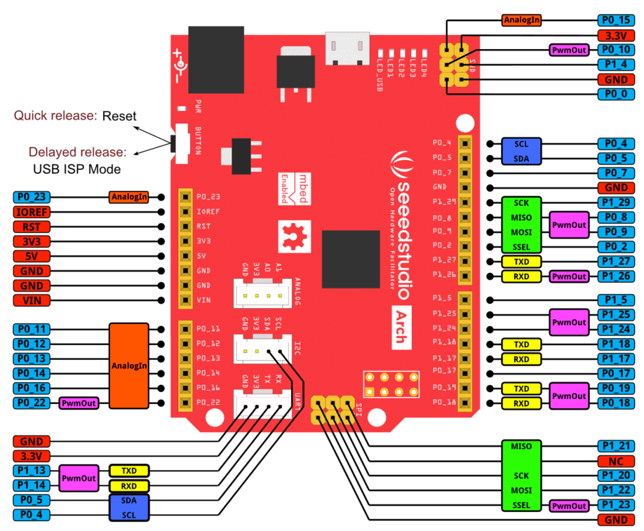
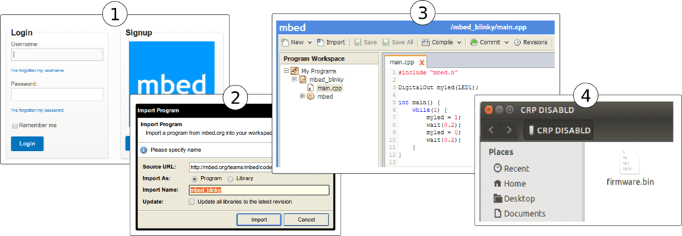

Arch V1.1 is an mbed enabled development board with Arduino form factor and Grove connectors for rapid prototyping. With a variety of Shield and Grove modules, mbed SDK and lots of software libraries, you can rapidly build a prototype.

[](http://www.seeedstudio.com/depot/seeeduino-arch-p-1561.html)


Version Tracker
-------

<table>
<colgroup>
<col width="25%" />
<col width="50%" />
<col width="25%" />
</colgroup>
<thead>
<tr class="header">
<th>Revision</th>
<th>Description</th>
<th>Release Date</th>
</tr>
</thead>
<tbody>
<tr class="odd">
<td><a href="/Seeeduino_Arch" title="Seeeduino Arch">Seeeduino Arch V1.0</a></td>
<td><ul>
<li>Initial public release</li>
</ul></td>
<td>2013-6-17</td>
</tr>
<tr class="even">
<td>Arch V1.1</td>
<td><ul>
<li>Change name from Seeeduino Arch to Arch</li>
<li>Switch D13 and D11</li>
<li>Add one Grove connector</li>
<li>Remove dual diode</li>
</ul></td>
<td></td>
</tr>
</tbody>
</table>

Features
-------

-   mbed enabled
    -   online development tools
    -   easy to use C/C++ SDK
    -   lots of published libraries, projects

-   Arduino form factor, three Grove connectors
    -   available with 3.3V compatible shields
    -   a large number of grove modules
-   Drag-n-drop programming
-   NXP LPC11U24 MCU
    -   Low power ARM Cortex-M0 Core
    -   48MHz, 32KB Flash, 8KB RAM, 4KB EEPROM
    -   USB Device, 2xSPI, UART, I2C

Specifications
-------------

| Item                          | Typical  |
|-------------------------------|----------|
| Work Voltage                  | 7 ~ 12V  |
| Microcontroller               | LPC11U24 |
| Flash Memory                  | 32KB     |
| EEPROM                        | 4KB      |
| RAM                           | 8KB      |
| UART                          | 1        |
| I2C                           | 1        |
| ADC Channels                  | 8        |
| I/O pins                      | 40       |
| Digital I/O Max input voltage | 5.0V     |


Hardware Overview
------



There is [a monochrome version](http://seeed-studio.github.io/Artwork/images/arch_v1.1_pinout_mono.png) for you to print.


Get Started
-----------



1.  Click [this link](https://mbed.org/compiler/#import:/teams/mbed/code/mbed_blinky/;platform:Seeeduino-Arch) to login or signup to mbed
2.  Import the mbed\_blinky program
3.  Coding! Then you can compile the code and download the output binary.
4.  Now connect your Arch board to your pc and long press the reset button, it will automatically appear as a USB driver named CRP DISABLD. Go to the CRP DISABLD, delete the firmware file and copy the download binary file to CRP DISABLD. Quick press the reset button to run the new binary.

You can change the code as following and try again.

```
    #include "mbed.h"

    BusOut leds(LED1, LED2, LED3, LED4);

    int main() {
        uint8_t count = 0;
        while(1) {
            leds = count++;
            wait(1);
        }
    }
```

Programming Arch on Windows, Linux or Mac
-----------------------------------------

Arch does not have an mbed interface. It uses USB In-System-Programming(ISP) to upgrade the firmware.

To enter the USB ISP mode, connect the Arch with your computer and long press its button, and then a disk named "CRP DISABLD" will appear.

-   On Windows
    1.  delete firmware.bin in the "CRP DISABLD" disk.
    2.  copy a new firmware into the disk.

-   On Linux
    1.  if the disk is not mounted, mount the disk at **{mnt\_dir}**
    2.  **dd if={new\_firmware.bin} of={mnt\_dir}/firmware.bin conv=notrunc**

-   On Mac you will need to use Terminal to run the following script to copy you're .bin file to your Arch

    1.  **dd if={new\_firmare.bin} of=/Volumes/CRP\\ DISABLD/firmware.bin conv=notrunc**


If you are so inclined, you can also create an **Automator** application to support drag-and-drop of the file to your board. Just create a "*Run Shell Script*" with the following command:

dd if=$\* of=/Volumes/CRP\\ DISABLD/firmware.bin conv=notrunc

You will also need to change the `"Pass Input"` option from `"to stdin"` to `"as arguments"`--without this you will get an error `"The action 'Run Shell Script' encountered an error"` or `"dd: no value specified for if (1)"` in the log.

Also, an improved form of the script is:

**`dd if="${1}" of=/Volumes/CRP\ DISABLD/firmware.bin conv=notrunc`**

Which should handle spaces in the file path and only uses the first file supplied.

Quick press the button to run the new firmware.

Applications
------------

-   [Use Seeeduino Arch as a debug adapter to debug another Seeeduino Arch](https://mbed.org/users/yihui/notebook/debug-seeeduino-arch-using-cmsis-dap/)
-   [Sense environment](https://mbed.org/users/yihui/notebook/sense-environment/)
-   [Play with Grove RTC](https://mbed.org/cookbook/seeed-grove-RTC)
-   [Play with Grove - Ultrasonic ranger](https://mbed.org/cookbook/Seeed-grove-ultrasonic-ranger)

Resources
---------

-   [Schematics of Arch V1.1](https://upverter.com/yihui/35f45e266de84e9c/Arch/)

<!-- This Markdown file was created from http://www.seeedstudio.com/wiki/Arch_V1.1 -->
