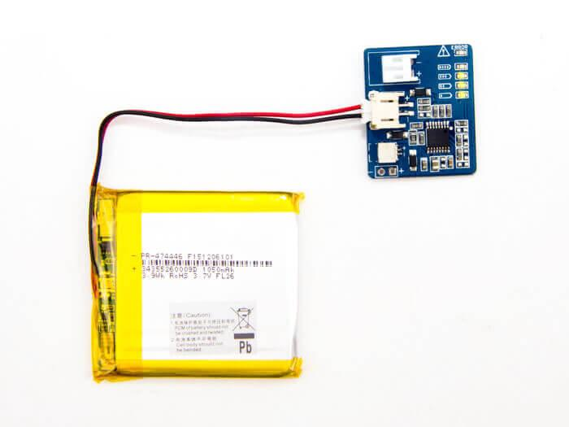
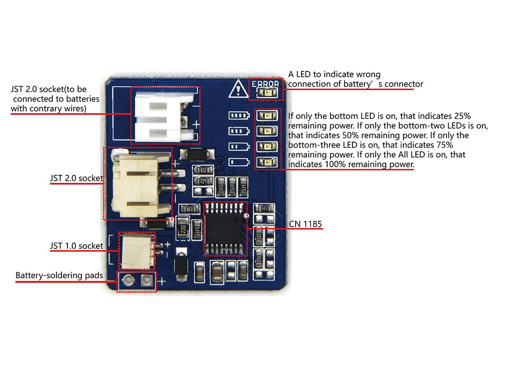

<!-- 
+++
title       = "Battery Detector with Polymer Lithium Ion 1050mAh 3.7V"
+++
 -->

# Battery Detector with Polymer Lithium Ion 1050mAh 3.7V

Introduction
------------

Battery Detector with Polymer Lithium Ion 1050mAh 3.8V contains two items: a 1050 mAh lithium-ion battery and a battery power detector to measure the power remain in a li-ion battery.

The li-ion battery is very slim, light and cost effective. It output 3.7 V voltage(nominal). You can also charge it with a specialized charger which has maximum input current 1050 mA and maximum input voltage 4.2V. This battery comes with pre-attached JST 2.0 connector which is handy to click in and out. It also has built-in overcurrent protection to protect against output short circuit. **Although, please still take caution and do not abuse the battery in usage. Never charge or use it unattended.**

The battery power detector can detect the input voltage range of 3–4.2 volts. There are three JST sockets (JST 1.0, JST 2.0 and JST 2.0) and two battery-soldering pads will adapt to those batteries with a different connector. As you connect a battery to this battery power detector, the on-board four LEDs will indicate remaining power in percentage (0–25%, 26–50%, 51–75%, 76–100%). Another LED will be on if you plug the connector of battery in the wrong way.

Notes

 1. There is only one battery reliable to be tested at the same time.

 2. It will damage this battery power detector as the input voltage is above 9 volts.

 3. Never use the battery when it is being charged.

Version Tracker
----------------

| Product revision                                                        | Release date | Support status | Notes |
|-------------------------------------------------------------------------|--------------|----------------|-------|
| Battery Detector with Polymer Lithium Ion 1050mAh 3.8V(current version) | May 2016     | Supported      | None  |

Features
--------

**For battery**

-   For Pre-attached JST 2.0 connector
-   Short circuit protection for output circuit
-   Cost-effective

**For battery power detector**

-   Visual indication on remaining power of a battery
-   Different JST sockets for different battery connectors

Specifications
--------------

**For battery**

|                            |                                             |
|----------------------------|---------------------------------------------|
| Capacity                   | 1050 mAh                                    |
| Nominal output voltage(DC) | 3.7 volts                                   |
| Connector                  | JST 2.0                                     |
| Maximum Charge Current     | 1050 mA                                     |
| Protection                 | Short circuit protection for output circuit |
| Weight                     | 19 g, the whole package weighs 33.5 g.      |
| Dimensions                 | 48(width)×4.9(height)×45(depth) mm          |

**For battery power detector**

|                   |                                                                                                                                           |
|-------------------|-------------------------------------------------------------------------------------------------------------------------------------------|
| Input voltage     | 3 – 4.2V                                                                                                                                  |
| Operating current | 15 mA                                                                                                                                     |
| Indication manner | Four LEDs (we will detail it later)                                                                                                       |
| Sockets           | Three sockets for different battery connector and two battery-soldering pads (we will detail it later)                                    |
| Dimensions        | 30(width)×25(depth) mm                                                                                                                    |
| CN1185            | [Datasheet](assets/Battery_Detector_with_Polymer_Lithium_Ion_1050mAh_3.7V/res/CN1185_Datasheet.pdf)                                      |
| Weight            | 3.2 g                                                                                                                                     |
| Notes             | Only connect a single battery to this module; The input voltage to this module should be less than 9 volts, or it will damage this module. |

Platforms supported(only for battery)
------------------------
<table>
<tr>
<td>
Platform
</td>
<td>
Seeeduino/Arduino
</td>
<td>
Rasberry Pi
</td>
<td>
Beaglebone
</td>
<td>
LinkIt ONE
</td>
</tr>
<tr>
<td>
Supported status
</td>
<td>
Supported
</td>
<td>
Not supported
</td>
<td>
Supported(only with [Grove Base Cape for Beaglebone](/Grove_Base_Cape_for_BeagleBone_v2))
</td>
<td>
Not supported
</td>
</tr>
<tr>
<td>
Notes
</td>
<td colspan="5">
If no version number is mentioned for a specific platform, it means this product supports all versions within this platform.
</td>
</tr>
</table>

Hardware Overview
-----------------

This section shows descriptions for components on battery power detector.

-   **CN1185**, a voltage monitoring circuit.
-   **Battery-soldering pads**, to solder battery's leads on.

### **Package includes**(main parts)

| Parts name             | Quantity |
|------------------------|----------|
| Li-ion battery         | 1 piece  |
| Battery power detector | 1 piece  |

Getting Started
---------------

Connect battery and battery power detector as in the following image. You can see LEDs are *ON* indicates actual power remains.

Resources
---------

-   [Schematic(Eagle) file](assets/Battery_Detector_with_Polymer_Lithium_Ion_1050mAh_3.7V/res/Battery_kit-3.7V_520mAh_Schematics.zip)
-   [CN1185 Datasheet](assets/Battery_Detector_with_Polymer_Lithium_Ion_1050mAh_3.7V/res/CN1185_Datasheet.pdf)
-   [Battery Usage Datasheet](assets/Battery_Detector_with_Polymer_Lithium_Ion_1050mAh_3.7V/res/Battery_Detector_with_Polymer_Lithium_Ion_1050mAh_3.7V_Battery_Datasheet.pdf)
-   [Battery Safety Datasheet and Certificates](assets/Battery_Detector_with_Polymer_Lithium_Ion_1050mAh_3.7V/res/Lithium-ion_Battery_3.7v-1050_mAh_Safety_Datasheet_and_Certificates.zip)

Help us make it better
-------------------------

<iframe frameborder="0" height="500" src="https://www.surveymonkey.com/r/SKZT678" width="500"></iframe>

<!-- 
+++
oldwikiurl       = "http://www.seeedstudio.com/wiki/Battery_Detector_with_Polymer_Lithium_Ion_1050mAh_3.7V"
+++
 -->

<!-- This Markdown file was created from http://www.seeedstudio.com/wiki/Battery_Detector_with_Polymer_Lithium_Ion_1050mAh_3.7V -->
