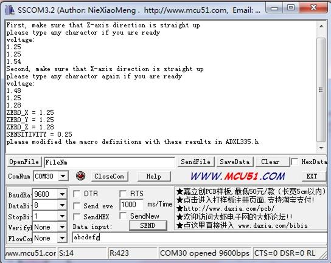

<!-- 
+++
title       = "Grove - 3-Axis Analog Accelerometer"
+++
 -->

# Grove - 3-Axis Analog Accelerometer

Introduction
------------

The ADXL335 is a small, thin, low power, complete 3-axis accelerometer with signal conditioned voltage outputs. The product measures acceleration with a minimum full-scale range of ±3 g.
The module was designed as breakout board because ADXL335's signal is analog( more ports requested ). But the board outline is grove module that you can fix it conveniently like other groves. The sensor combined 3.3 and 5V power supply, can be used in standard Arduino device and Seeeduino Stalker. The following program code includes first-order filter which can make the output smoothly if the sensor was used in robot or toy car.

Features
--------

-   Wide power range DC3V to 5V
-   Grove outline
-   3 axis sensing
-   Small, low-profile package: 4×4×1.45mm LFCSP
-   Low power 350µA at 3V (typical)
-   High sensitive
-   10,000 g shock survival
-   BW adjustment with a single capacitor per axis
-   RoHS/WEEE lead-free compliant

Application Ideas
-----------------

-   Motion Sensor
-   Shock detector
-   Vibration sensor
-   Toy car
-   Robot

Usage
-----

The sensor's outline is breakout board, you can welding wire in the board or use jumper wire to connect the sensor.

-   The VCC connect to power source（DC5V or DC3.3V）, GND to ground, X to Arduino analog port A0, Y to A1, Z to A2.
    
-   Download the [3-Axis Analog Accelerometer Library](assets/Grove-3-Axis_Analog_Accelerometer/res/AnalogAccelerometer.zip) and Unzip it into the libraries file of Arduino IDE by the path: ..\\arduino-1.0.1\\libraries.
-   Regulate the sensor

The sensor is analog device, you should regulate the sensor before combining it with your system.

**Step 1:** Open the Demo: Calibration and upload it to Arduino.Please click [here](/Upload_Code) if you do not know how to upload.

**Step 2:** Open your serial monitor, make sure the sensor is connected. Follow the axis institutions printed on sensor's board. First, make sure that Z-axis direction is straight up, please type any character if you are ready. Change the sensor position, repeat the above operation to obtain X-axis and Y-axis direction are straight up .

**Step 3:** You can get the values as shown above. Please modify the macro definitions with these results in ADXL335.h

Now the calibration has been completed.

-   Downloading the demo code: Measuring Acceleration, then open serial monitor, turn the sensor any angle, you can see the digital angle value sent from the accelerometer to the monitor.

Resources
---------

-   [Grove - 3-Axis Analog Accelerometer Eagle File](assets/Grove-3-Axis_Analog_Accelerometer/res/Grove-3-Axis_Analog_Accelerometer_Eagle_File.zip)

-   [3-Axis Analog Accelerometer Library](assets/Grove-3-Axis_Analog_Accelerometer/res/AnalogAccelerometer.zip)

-   [github repository for 3-Axis Analog Accelerometer](https://github.com/Seeed-Studio/Grove_3Axis_Analog_Accelerometer)

-   [ADXL335 datasheet.pdf](assets/Grove-3-Axis_Analog_Accelerometer/res/ADXL335_datasheet.pdf)

Help us make it better
-------------------------

<iframe frameborder="0" height="500" src="https://www.surveymonkey.com/r/GMDWJPS" width="500"></iframe>

<!-- 
+++
oldwikiurl       = "http://www.seeedstudio.com/wiki/Grove_-_3-Axis_Analog_Accelerometer"
+++
 -->

<!-- This Markdown file was created from http://www.seeedstudio.com/wiki/Grove_-_3-Axis_Analog_Accelerometer -->
