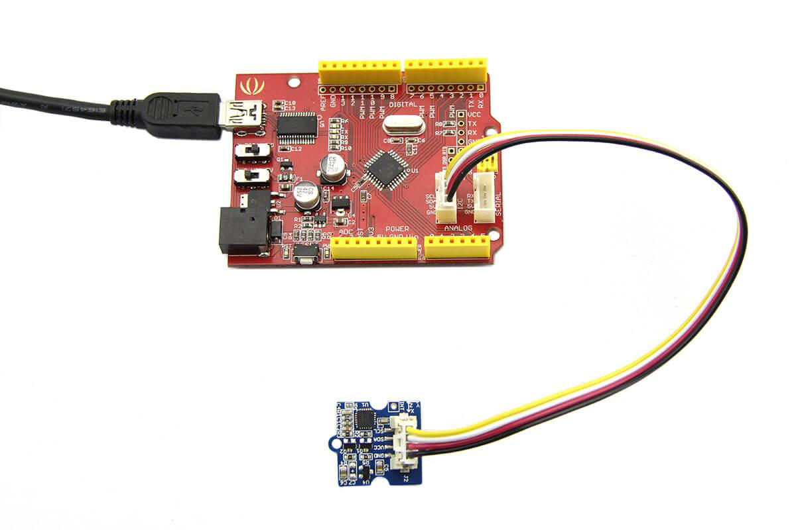
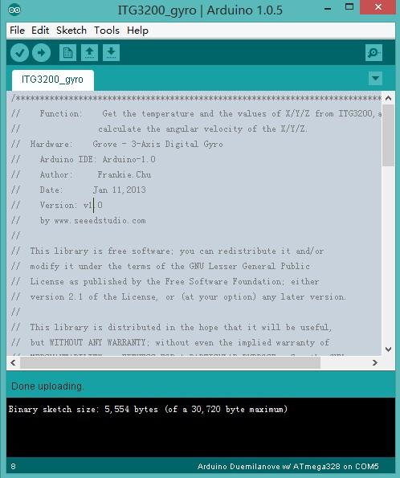

<!-- 
+++
title       = "Grove - 3-Axis Digital Gyro"
+++
 -->

# Grove - 3-Axis Digital Gyro

Introduction
------------

Grove - 3-Axis Digital Gyro module based on ITG 3200. It is the world’s first single-chip, digital-output, 3-axis MEMS motion processing gyro optimised for gaming, 3D mice, and motion-based remote control applications for Internet connected Digital TVs and Set Top Boxes. The ITG-3200 features three 16-bit analog-to-digital converters (ADCs) for digitising the gyro outputs, a user-selectable internal low-pass filter bandwidth, and a Fast-Mode [I2C](/index.php?title=I2CAndaction=editAndredlink=1) (400kHz) interface.

Features
--------

-   Supply Voltage: 3.3V, 5V
-   Operation Current: 6.5mA
-   Standby current: 5μA
-   Sensitivity: 14 LSBs per °/sec
-   Full scale range: ±2000°/sec
-   Acceleration: 10,000g for 0.3ms
-   I2C Interface
-   ±2000°/s full scale range and 14.375 LSBs per °/s sensitivity
-   Three integrated 16-bit ADCs
-   On-chip temperature sensor
-   Integrated amplifiers and low-pass filters
-   Hermetically sealed for temp and humidity resistance
-   RoHS and Green compliant

Demonstration
-------------

This demo will show you how to get data from this digital gyro, the data is in the unit of rad/s.

Here we need a Grove - 3-Axis Digital Gyro and a Seeeduino V3.0.

### Hardware Installation

Hardware installation is very easy, because there's an I2C Grove in Seeeduino,

So, what we need to do is connect it to I2C Grove via a Grove cable.

### Download Code and Upload

You can download the library in github, click [here](https://github.com/Seeed-Studio/Grove_3_Axis_Digital_Gyro/), then extract it to libraries folder of Arduino.

Then open File -> examples -> Grove_3_Digital_Gyro -> ITG3200_gyro, you can open the demo code.

Click Upload to upload the code, if you have any problem about how to start Arduino, please click [here](/Getting_Started_with_Seeeduino) for some help.

### Check the result

Now, you can open the serial monitor to check the result.

Reference
---------

The diagram below shows the orientations of the 3 axes. You can use it to understand the physical meanings of the result.

Resources
---------

-   [Datasheet of ITG-3200.](http://garden.seeedstudio.com/images/a/a9/ITG-3200.pdf)
-   [Grove - 3-Axis Digital Gyro Eagle File](assets/Grove-3-Axis_Digital_Gyro/res/Grove-3-Axis_Digital_Gyro_Eagle_File.zip)
-   [Digital Gyro Library](https://github.com/Seeed-Studio/Grove_3_Axis_Digital_Gyro)

Help us make it better
-------------------------

<iframe frameborder="0" height="500" src="https://www.surveymonkey.com/r/GRJ969Z" width="500"></iframe>

<!-- 
+++
oldwikiurl       = "http://www.seeedstudio.com/wiki/Grove_-_3-Axis_Digital_Gyro"
+++
 -->

<!-- This Markdown file was created from http://www.seeedstudio.com/wiki/Grove_-_3-Axis_Digital_Gyro -->
