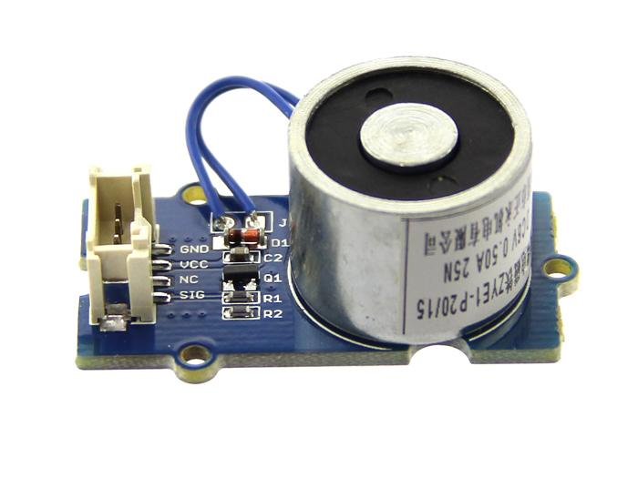
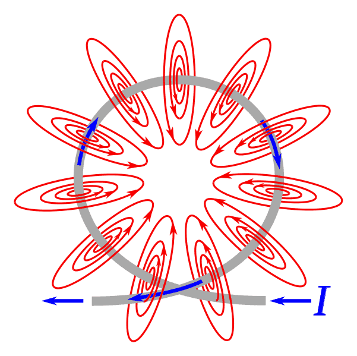
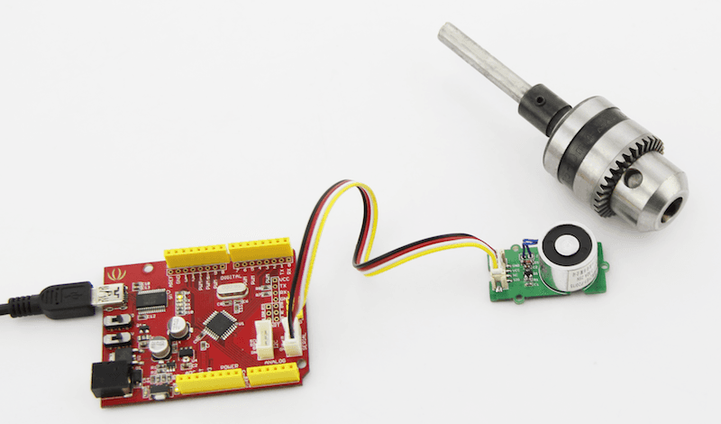
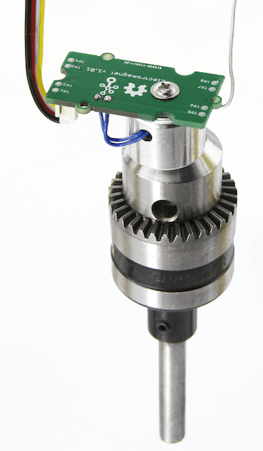

<!-- 
+++
title       = "Grove - Electromagnet"
+++
 -->

# Grove - Electromagnet

Introduction
------------





An electromagnet is a type of magnet in which the magnetic field is produced by electric current. An electric current flowing in a wire creates a magnetic field around the wire, due to Ampere's law(see drawing below). To concentrate the magnetic field, in an electromagnet the wire is wound into a coil with many turns of wire lying side by side. The magnetic field of all the turns of wire passes through the center of the coil, creating a strong magnetic field there. Grove - Electromagnet can suck 1KG weight and hold on. It is easy to use, to learn electromagnet principle.

[](http://www.seeedstudio.com/Grove-Electromagnet-p-1820.html)

Features
--------

-   Grove shape
-   1KG peak suction
-   Low standby current

Specifications
-------------

-   Working Voltage ：DC 5V
-   Working Current ： 400mA
-   Standby current ： 200uA
-   Load Weight： 1KG

Usage
-----

### With [Arduino](/index.php?title=ArduinoAndaction=editAndredlink=1 "Arduino")

 



CODE:

```
    /*
      Turns on an Electromagnet on for one second, then off for one second, repeatedly.

      This example code is in the public domain.
     */

    int Electromagnet = 0;
    int LED = 13;

    // the setup routine runs once when you press reset:
    void setup() {                
      // initialize the digital pin as an output.
      pinMode(Electromagnet, OUTPUT); 
      pinMode(LED, OUTPUT);   
    }

    // the loop routine runs over and over again forever:
    void loop() {
      digitalWrite(Electromagnet, HIGH); // turn the Electromagnet on (HIGH is the voltage level)
      digitalWrite(LED, HIGH);   // turn the LED on (HIGH is the voltage level)
      delay(1000);               // wait for a second
      digitalWrite(Electromagnet, LOW);// turn the Electromagnet off by making the voltage LOW
      digitalWrite(LED, LOW);  // turn the LED off by making the voltage LOW
      delay(1000);               // wait for a second
    }
```

### With [Raspberry Pi](/GrovePiPlus "GrovePi+")

1.You should have got a raspberry pi and a grovepi or grovepi+.

2.You should have completed configuring the development enviroment, otherwise follow [here](/GrovePiPlus#Introducing_the_GrovePi.2B).

3.Connection

-   Plug the sensor to grovepi socket D4 by using a grove cable.

4.Navigate to the demos' directory:
```
    cd yourpath/GrovePi/Software/Python/
```

-   To see the code

```
    nano grove_electromagnet.py   # "Ctrl+x" to exit #
```
```
    import time
    import grovepi

    # The electromagnet can hold a 1KG weight

    # Connect the Grove Electromagnet to digital port D4
    # SIG,NC,VCC,GND
    electromagnet = 4

    grovepi.pinMode(electromagnet,"OUTPUT")
    time.sleep(1)

    while True:
        try:
            # Switch on electromagnet
            grovepi.digitalWrite(electromagnet,1)
            print "on"
            time.sleep(2)

            # Switch off electromagnet
            grovepi.digitalWrite(electromagnet,0)
            print "off"
            time.sleep(2)

        except KeyboardInterrupt:
            grovepi.digitalWrite(electromagnet,0)
            break
        except IOError:
            print "Error"
```

5.Run the demo.
```
    sudo python grove_electromagnet.py
```

Resources
--------

- [Grove Electromagnet v1.0 SCH PCB.zip](assets/Grove-Electromagnet/res/Grove_Electromagnet_v1.0_SCH_PCB.zip "File:Grove Electromagnet v1.0 SCH PCB.zip")
- [Datasheet ZYE1-P20-15 PDF](assets/Grove-Electromagnet/res/ZYE1-P20-15.pdf)

Help us make it better
-------------------------

<iframe frameborder="0" height="500" src="https://www.surveymonkey.com/r/FNCX39X" width="500"></iframe>

<!-- 
+++
oldwikiurl       = "http://www.seeedstudio.com/wiki/Grove_-_Electromagnet"
+++
 -->

<!-- This Markdown file was created from http://www.seeedstudio.com/wiki/Grove_-_Electromagnet -->
