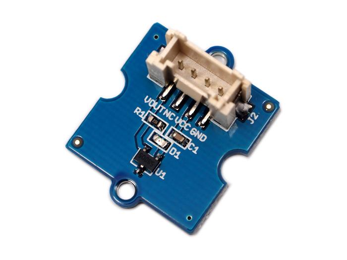
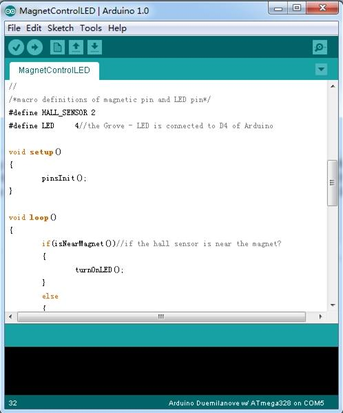

<!-- 
+++
title       = "Grove - Hall Sensor"
+++
 -->

# Grove - Hall Sensor

Introduction
------------

The Hall sensor is based on Hall Effect, which is the production of a voltage difference across an electrical conductor, transverse to an electric current in the conductor and a magnetic field perpendicular to the current. There is a continuous-time switch on this Grove. The output of these devices switches low (turns on) when a magnetic field (south polarity) perpendicular to the Hall sensor exceeds the operate point threshold BOP, and it switches high (turn off) when the magnetic field disappears. The twig can be used to measure RPM.

Version Tracker
---------------

| Revision | Descriptions           | Release    |
|----------|------------------------|------------|
| v0.9b    | Initial public release | 3,Oct,2011 |

Features
--------

-   Grove Compatible Interface
-   400ns transition period for rise and fall.
-   Continuous-time hall effect sensor
-   Reverse battery protection

Specifications
-------------

| Item                  | Min | Typical | Max | Unit |
|-----------------------|-----|---------|-----|------|
| Supply Voltage        | 3.8 | 5.0     | 24  | V    |
| Supply Current        | 4.1 | -       | 24  | mA   |
| Operating Temperature | -40 | -       | 85  | ºC   |

Application Ideas
-----------------

-   RPM meter.
-   Simple dc motor.

Getting Started
---------------

The Hall Sensor is used by utilizing the external interrupts available on the arduino/seeeduino. In this example we are using interrupt 0, found on digital pin 2. For other interrupts, see the [attachInterrupt()](http://www.arduino.cc/en/Reference/AttachInterrupt).

-   Connect the Hall Sensor to Digital port 2 of the [Grove - Base Shield](/Grove-Base_Shield) using a 4 pin cable and connect Grove-LED to Digital Port 4.
-   Then connect Arduino to PC by using a USB cable.
-   Download the [Hall Sensor Code](assets/Grove-Hall_Sensor/res/Grove-Hall_Sensor_Demo_Code.zip)
-   Open one of two code. For example Demo **MagnetControlLED**

-   Upload the code, Please click [here](/Upload_Code) if you do not know how to upload.
-   When a magnet whose south pole is facing up is approaching to the onboard sensor, the LED will be turned on. Otherwise, the LED will be turned off.

Resources
---------

-   [Grove-Hall Sensor Eagle File](assets/Grove-Hall_Sensor/res/Twig_Hall_Sensor_v0.9b.zip)
-   [Hall Sensor Demo Code](assets/Grove-Hall_Sensor/res/Grove-Hall_Sensor_Demo_Code.zip)
-   [A1101 datasheet](http://www.allegromicro.com/en/Products/Part_Numbers/1101/1101.pdf)

Help us make it better
-------------------------

<iframe frameborder="0" height="500" src="https://www.surveymonkey.com/r/L2FCSPY" width="500"></iframe>

<!-- 
+++
oldwikiurl       = "http://www.seeedstudio.com/wiki/Grove_-_Hall_Sensor"
+++
 -->

<!-- This Markdown file was created from http://www.seeedstudio.com/wiki/Grove_-_Hall_Sensor -->
