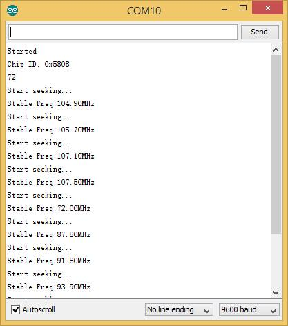

<!-- 
+++
title       = "Grove - I2C FM Receiver"
+++
 -->

# Grove - I2C FM Receiver

Introduction
------------

Grove - I2C FM Receiver is a wideband FM receiver module, this module is based on RDA5807M. The RDA5807M series is the newest generation single-chip broadcast FM stereo radio tuner with fully integrated synthesizer. The RDA5807M series has a powerful low-IF digital audio processor. The Grove - I2C FM Receiver has a headset jack, so it can connect to earphones or audio.

Version Tracker
---------------

| Revision                      | Description             | Release date  |
|-------------------------------|-------------------------|---------------|
| Grove - I2C FM Receiver v1.0  | Initial public release  |               |
| Grove - I2C FM Receiver v1.1  | Fixed bug - DFM for J3  | Dec 2, 2011   |

Features
--------

-   Grove interface
-   Supports worldwide frequency band: 50 - 115MHz
-   Support RDS/RBDS
-   Lower power consumption
-   Headset interface
-   Digital auto gain control
-   Input voltage: 3.3V - 5V

Usage
-----

We can change channel by Grove - Button and adjust volume by Grove - Rotary

### Hardware Installation

Part list：

-   Seeeduino Lotus
-   Grove - I2C FM Receiver
-   Grove - Button
-   Grove - Rotary
-   Earphone

### Software Part

1.  Download the code [I2C FM Receiver](https://github.com/Seeed-Studio/I2C_FM_Receiver).
2.  Unzip it into the libraries file of Arduino IDE by the path: ..\\arduino-1.0.5\\libraries.
3.  Open the code directly from the path: File -> Example -> I2C\_FM\_Receiver.
4.  Upload the code. Note that you should select the correct board type and COM port.

You can see Center Frequency:

Resources
---------

-   [Grove - I2C FM Receiver v1.0 Eagle File](assets/Grove-I2C_FM_Receiver/res/Grove_I2C_FM_Receiver_v1.0.zip)
-   [v1.0 Schematic in pdf](assets/Grove-I2C_FM_Receiver/res/Grove_I2C_FM_Receiver_v1.1_PDF.pdf)
-   [Datasheet of RDA5807M](assets/Grove-I2C_FM_Receiver/res/RDA5807M_datasheet_v1.1.pdf)
-   [Grove - I2C FM Receiver v1.1 Eagle File](assets/Grove-I2C_FM_Receiver/res/Grove_I2C_FM_Receiver_v1.1_Eagle.zip)

Help us make it better
-------------------------

<iframe frameborder="0" height="500" src="https://www.surveymonkey.com/r/WDHZVPS" width="500"></iframe>

<!-- 
+++
oldwikiurl       = "http://www.seeedstudio.com/wiki/Grove_-_I2C_FM_Receiver"
+++
 -->

<!-- This Markdown file was created from http://www.seeedstudio.com/wiki/Grove_-_I2C_FM_Receiver -->
