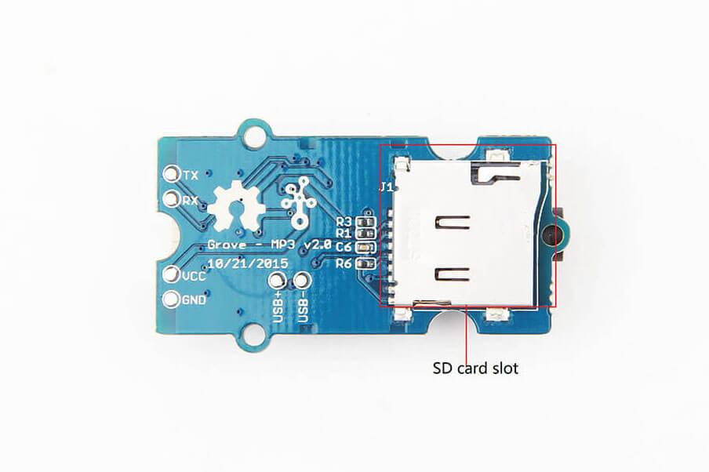
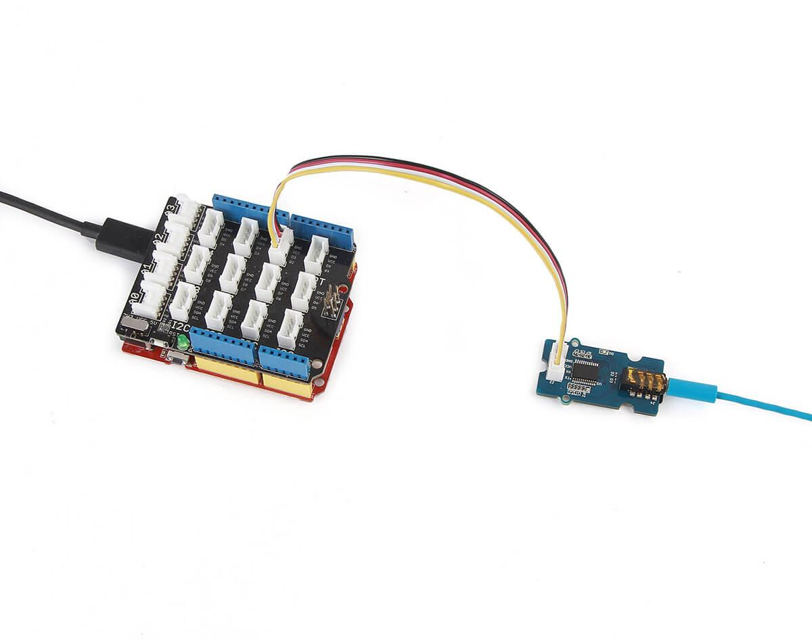

Grove - MP3 v2.0 is a tiny-sized and compact audio module. It supports various audio file operations for an audio file of MP3, WAV and WMV format, such as random music playing, play music in specific files, and so on. With serial communication, you can use all predefined command or command combinations to do all operations on music files. This module also supports general file systems such as FAT16 and FAT32. It gets a Grove UART interface, a 3.5 mm audio jack and a micro-SD slot. With this module, you can add some noise to your silent applications.

Version Tracker
---------------
| Product revision  | Release date   | Support status |
|-------------------|----------------|----------------|
| Version 1.0       | April 28 2013‎  | Supported      |
| Version 2.0       | Dec 15 2015    | Supported      |

Features
--------

-   General operations on audio files
-   On-board micro-SD slot and 3.5 mm audio jack
-   Support sample rate of 8 / 11.025 / 12 / 16 / 22.05 / 24 / 32 / 44.1 / 48(KHz)
-   24-bit DAC output, 90 dB (at Max.) dynamic output range, signal-noise ratio at 85 dB
-   MP3, WMV and WAV audio format and FAT16, FAT32 files system supported
-   Embed 10 levels of equalization in total

Application ideas
-----------------

-   Middle-level audio module for any applications.

Specifications
-------------

| Parameter                                  | Value                                                                                                             |
|--------------------------------------------|-------------------------------------------------------------------------------------------------------------------|
| Input                                      | 5 V (DC)                                                                                                          |
| Operating current (no signal output state) | less than 15 mA                                                                                                   |
| Operating current                          | less than 40 mA                                                                                                   |
| Chip                                       | KT403A [(datasheet)](assets/Grove-MP3_v2.0/res/Grove-MP3_v2.0_KT403A_datasheet_V1.3_EN-Recompiled_by_Seeed-.pdf) |
| Chip LDO output voltage                    | 3.3 V                                                                                                             |
| Chip output current                        | 100mA(at Max.)                                                                                                    |
| File formats supported                     | MP3, WAV, WMA                                                                                                     |
| Maximum memory supported for SD card       | 32 GB                                                                                                             |
| Sampling rate                              | 8 / 11.025 / 12 / 16 / 22.05 / 24 / 32 / 44.1 / 48(KHz)                                                           |

Platforms supported
-------------------

| **Seeeduino/Arduino**                  | **Raspberry Pi**                           | **BeagleBone**                       | **LinkIt ONE**                      |
|----------------------------------------|--------------------------------------------|--------------------------------------|-------------------------------------|
|    |   |      |  |

Note

If no version number is mentioned for a specific platform, it means this product supports all versions within this platform. But, you will need additional Grove Shield like Grove - Base shield v2 board.

Hardware Overview
-----------------

### **Parts list**

| Parts name              | Quantity |
|-------------------------|----------|
| Grove - MP3 v2.0        | 1PC      |
| Grove - Universal Cable | 1PC      |

Get started
-----------

### **Material required**

-   Seeeduino × 1
-   Grove - Base Shield v2 × 1
-   Grove - MP3 v2.0 × 1
-   SD card with music inside × 1
-   USB cable (type A to micro type-B) × 1
-   Headset, earphone or stereo with 3.5 mm audio jack × 1

### Preparations

Refer to following guides to building an appropriate IDE:.

Note

We have chosen Seeeduino and it is compatible with Arduino in this case. So you can also use Arduino board instead.

[Getting Started on Windows](/Seeeduino_v4.2#Getting_Started_on_Windows)

[Getting Started on Mac OS X](/Seeeduino_v4.2#Getting_Started_on_Mac_OS_X)

### Hardware connections

### A example to run

#### Download example

1.Github [address](https://github.com/Seeed-Studio/Grove_Serial_MP3_Player_V2.0) which also contain sufficient API to download codes.

2.Refer to [here](/Guide_to_use_demos_downloaded_from_Seeed's_Github) to learn how to do some preliminary work before running code.

3.Load file *MP3_Play_Test.ino* into Arduino and upload to the main controller board.

4.Open Serial Monitor (Ctrl + Shift + M) to send a command to play music.

Note

We need to choose No line ending beside baud rate droplist at bottom-right of Serial Monitor window.

5.In this case, we type *1* which is a command to play music. You can find more command comments in demo source code.

6.Now enjoy the music.

### Advanced programming

For advanced programming, you can [download](assets/Grove-MP3_v2.0/res/Grove-MP3_v2.0_KT403A_datasheet_V1.3_EN-Recompiled_by_Seeed-.pdf) datasheet of chip KT403A.

Resources
---------

-   Hardware [Schematic files](assets/Grove-MP3_v2.0/res/Grove-MP3_v2.0_Schematic_files.zip)
-   [Libraries](https://github.com/Seeed-Studio/Grove_Serial_MP3_Player_V2.0) on Github.
-   KT403A [Datasheet](assets/Grove-MP3_v2.0/res/Grove-MP3_v2.0_KT403A_datasheet_V1.3_EN-Recompiled_by_Seeed-.pdf) (part)

Help us make it better
----------------------

<!-- This Markdown file was created from http://www.seeedstudio.com/wiki/Grove_-_MP3_v2.0 -->
