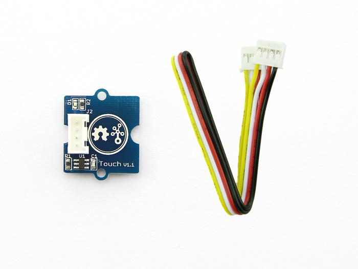

Grove - Touch Sensor enables you to replace press with touch. It can detect the change in capacitance when a finger is near by. That means no matter your finger directly touches the pad or just stays close to the pad, Grove - Touch Sensor would outputs HIGH also.

[](http://www.seeedstudio.com/Grove-Touch-Sensor-p-747.html)

Specifications
--------------

- Operating Voltage: 2.0 - 5.5V
- Operating Current(Vcc=3V):1.5 - 3.0μA
- Operating Current(VDD=3V):3.5 - 7.0μA
- Output Response Time: 60 - 220mS
- Used Chipset: TTP223-BA6

**Option features**

| AHLB                     | TOG         | LPMB       | MOTB         | SLRFTB          | RST       | Q           | OPDO            |
|--------------------------|-------------|------------|--------------|-----------------|-----------|-------------|-----------------|
| Output Active High / Low | Toggle mode | Power Mode | Max. On Time | Sampling length | RESET PIN | CMOS Output | Open Drain Mode |
| V                        | V           | 0          | 1            | 1               | X         | V           | X               |
| Active High              | Disabled    | LOW        | Infinite     | 1.6 msec        | N/A       | Present     | N/A             |

Demonstration
-------------

### With [Arduino](/index.php?title=ArduinoAndaction=editAndredlink=1)


This demo is going to show you how to turn on/off an LED.

**Demo Code:**

```
const int TouchPin=9;
const int ledPin=12;
void setup() {
pinMode(TouchPin, INPUT);
pinMode(ledPin,OUTPUT);
} 
 
void loop() {
int sensorValue = digitalRead(TouchPin);
if(sensorValue==1)
{
digitalWrite(ledPin,HIGH);
}
else
{
digitalWrite(ledPin,LOW);
}
}
```

### With [Raspberry Pi](/GrovePiPlus "GrovePi+")

1.  You should have a raspberry pi and a grovepi or grovepi+.
2.  You should have completed configuring the development environment, otherwise follow [here](/GrovePiPlus#Introducing_the_GrovePi.2B).
3.  Connection

    -   Plug the sensor to grovepi socket D4 by using a grove cable.

4.  Navigate to the demos' directory:

```
    cd yourpath/GrovePi/Software/Python/
```

   - To see the code


```
    nano grove_touch_sensor.py   # "Ctrl+x" to exit #
```
```
    import time
    import grovepi

    # Connect the Grove Touch Sensor to digital port D4
    # SIG,NC,VCC,GND
    touch_sensor = 4

    grovepi.pinMode(touch_sensor,"INPUT")

    while True:
        try:
            print grovepi.digitalRead(touch_sensor)
            time.sleep(.5)

        except IOError:
            print "Error"

```

5.Run the demo.

        sudo python grove_touch_sensor.py


Resources
---------

-   [Eagle Files](assets/Grove-Touch_Sensor/res/Touch_sensor_Eagle_File.zip)
-   [TTP223pdf](http://garden.seeedstudio.com/images/d/d5/TTP223.pdf)
-   [how to upload code](/Upload_Code)

<!-- This Markdown file was created from http://www.seeedstudio.com/wiki/Grove_-_Touch_Sensor -->
