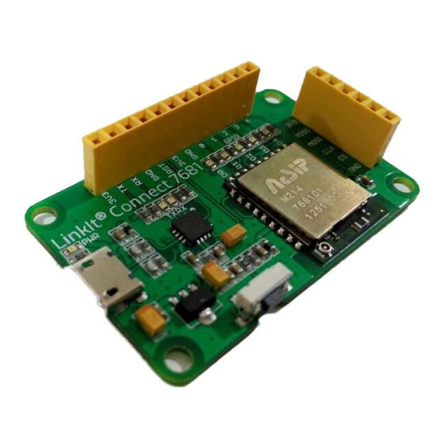
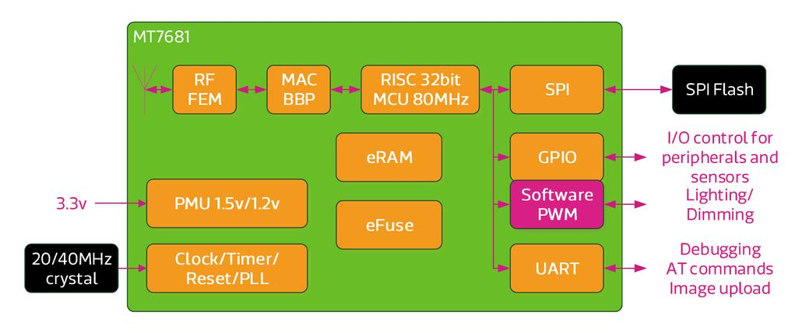
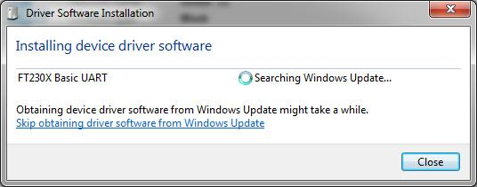
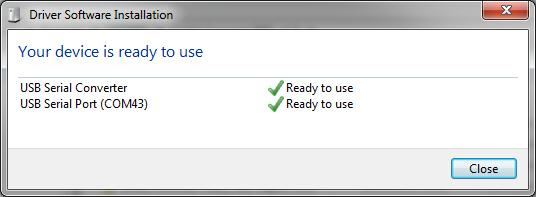

The LinkIt Connect 7681 development board provides easy access to the five GPIO pins and one UART port — each with an LED — of the MT7681, to quickly connect peripheral controllers and electronic circuits. The MT7681 is provided on the LinkIt Connect 7681 module, which was co-designed with AcSiP. This module, which is only 15 x 18mm, will also be available separately for direct integration into your product’s PCB.

Key Features
------------

-   Access to the five GPIO pins and one UART port provided by MT7681, with attached LEDs
-   WiFi antenna integrated on Linkit 7681 module
-   Power over USB (Micro USB port).
-   Open source hardware board reference design, including schematic, layouts, and pin details.

Specifications
--------------

-   Chipset Core: MT7681 ANDES N9
-   Clock Speed: 80MHz
-   Flash: 1MB
-   RAM: 64KB
-   Power: on-board 1A 3.3V voltage regulator (can be powered from USB connector)
-   Connectors: UART/GPIO/SPI pins are available on connectors(100mil/2.54mm pitch);micro USB connector.
-   GPIO Voltage: 3.3V
-   PWM Output pin Count: 5
-   PWM levels: 0~20
-   UART Voltage: 3.3V
-   Wi-Fi Spec: 802.11 b/g/n for Station mode; 802.11 b/g for AP mode
-   Dimensions: 50 x 31 mm
-   Other: Onboard reset push-button.

Hardware Overview
-------------

Getting Started
---------------

### Install USB Driver

Connect LinkIt Connect 7681 development board to PC’s USB port using a USB cable. The driver will be automatically installed.(As shown below in Windows7 OS)

Note

If the driver does not install successfully, you can download and install <a class="external text" href="http://www.ftdichip.com/Drivers/VCP.htm" rel="nofollow" target="_blank">FTDI Driver</a> manually.

Getting started with [MediaTek LinkIt Connect 7681 Developer’s Guide](http://labs.mediatek.com/fileMedia/download/60b77480-f08e-46de-b4ab-513916dcff75)

This document provides you with a detailed introduction to the MediaTek LinkIt Connect 7681 SDK, step-by-step installation guide, and details on how to use it to create and run Wi-Fi applications. It also covers how to use the board upgrade tool provided in the SDK, an overview of the APIs and several how-to guides to undertake common Wi-Fi operations with code example. Details on how to create MediaTek Smart Connection apps for Android and iOS are also included.

Resources
---------

-   [MediaTek LinkIt Connect 7681 Developer’s Guide](http://labs.mediatek.com/fileMedia/download/60b77480-f08e-46de-b4ab-513916dcff75)
-   [MediaTek LinkIt Connect 7681 API Reference](http://labs.mediatek.com/fileMedia/download/5a44333c-f56a-47e6-ad03-9acfa33c9561)
-   [LinkIt Connect 7681 Hardware Reference Design](http://labs.mediatek.com/fileMedia/download/ff4f5863-55b0-4664-b189-b705153cf061)
-   [MediaTek LinkIt™ Connect 7681 SDK](http://labs.mediatek.com/site/global/developer_tools/mediatek_7681/sdk_intro/index.gsp)

<!-- This Markdown file was created from http://www.seeedstudio.com/wiki/Linkit_Connect_7681 -->
